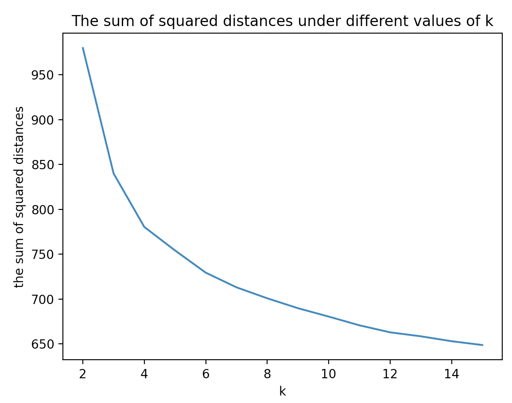
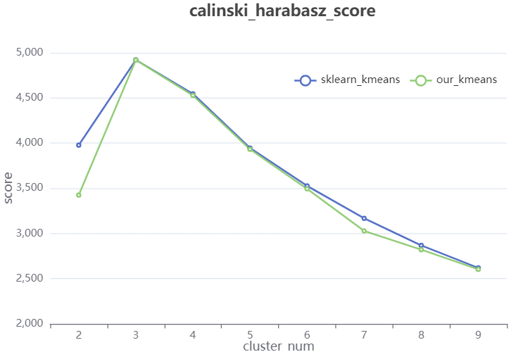

# 聚类分析

## 1 数据集介绍

我们选取的数据集是[Codon usage Data Set](https://archive.ics.uci.edu/ml/datasets/Codon+usage)，包含了来自不同种群的大量生物样本的DNA密码子出现频率。其中一共具有13028条数据，截取部分数据如下所示。

| Kingdom | DNAtype | SpeciesID | Ncodons |               SpeciesName               |   UUU   |   UUC   |   UUA   | ...  |   UGA   |
| :-----: | :-----: | :-------: | :-----: | :-------------------------------------: | :-----: | :-----: | :-----: | :--: | :-----: |
| **vrl** |    0    |  100217   |  1995   | Epizootic haematopoietic necrosis virus | 0.01654 | 0.01203 |  5E-04  | ...  |    0    |
| **vrl** |    0    |  100220   |  1474   |            Bohle iridovirus             | 0.02714 | 0.01357 | 0.00068 | ...  |    0    |
| **vrl** |    0    |  100755   |  4862   |      Sweet potato leaf curl virus       | 0.01974 | 0.0218  | 0.01357 | ...  | 0.00144 |
| **vrl** |    0    |  100880   |  1915   |      Northern cereal mosaic virus       | 0.01775 | 0.02245 | 0.01619 | ...  |    0    |

每条数据的属性如下：

|     列      |                  属性                   |
| :---------: | :-------------------------------------: |
|  Column 1   |            Kingdom，所属物种            |
|  Column 2   |            DNAtype，DNA类型             |
|  Column 3   |            SpeciesID，物种ID            |
|  Column 4   |           Ncodons，密码子总数           |
|  Column 5   |          SpeciesName，物种名称          |
| Column 6-69 | codon frequencies，某一密码子的出现频率 |

其中，数据集中的频率已是归一化后的结果，无需进一步的处理：
$$
某一密码子的频率=\frac{某一密码子的出现次数}{密码子总数\ Ncodons}
$$
我们将对64种密码子出现的频率作聚类分析，以探索密码子的组成与物种之间的关系。

## 2 数据分析与预处理

首先，我们导入相关工具，并读取数据，检测一共存在哪些物种类别。

```python
import pandas as pd
import numpy as np
from numpy import *
import matplotlib.pyplot as plt
from scipy.spatial.distance import pdist

dna = pd.read_csv('codon_usage.csv')
dna['Kingdom'].value_counts()
```

结果显示如下，数据集中主要的物种为bct(细菌)、vrl(病毒)、pln(植物)、vrt(脊椎动物)、inv(无脊椎动物)等。

```
bct    2919
vrl    2831
pln    2523
vrt    2077
inv    1345
mam     572
phg     220
rod     215
pri     180
arc     126
plm      18
```

由于我们主要需要寻找的是密码子的组成与物种之间的关系，因此“DNAtype“、”SpeciesID“、”Ncodons“、”SpeciesName“等信息是无意义的，需要对其进行剔除。

```python
dna.drop(columns=['DNAtype','SpeciesID','Ncodons','SpeciesName'],inplace=True)
```

为了得到适合的聚类数，我们决定采用交叉验证法。因此在聚类之前，我们将数据等分为10份——其中的9份数据用于训练模型，剩下的1份用于测试集群的质量。对于不同的聚类数k，重复10次，比较不同k的总体质量度量，从而找到最适合的簇数。

```python
from sklearn.utils import shuffle

dna = shuffle(dna)
for i in range(1, 11):
    data = dna[1302*(i-1) : 1302*i - 1]
    data.to_csv("data" + str(i) + ".csv", index=False)
```

## 3 聚类处理

若采用基于密度的方法进行聚类分析，比如DBSCAN算法，由于我们数据的维度过大，因此参数的选取非常困难。比如，DBSCAN用固定参数识别聚类，但当聚类的稀疏程度不同时，相同的判定标准可能会破坏聚类的自然结构，即较稀的聚类会被划分为多个类或密度较大且离得较近的类会被合并成一个聚类。

若采用基于层次的方法进行聚类，比如BIRCH算法，一方面时间复杂度较高，另一方面，阈值threshold难以取得，经过我们初步的测试，效果并不是非常理想。我们采用Python提供的机器学习库sklearn，对以上数据集进行了简单的聚类分析。

```Python
from sklearn.cluster import Birch

data = dna.iloc[:,1:].astype(float)
k = Birch(n_clusters = 5, threshold = 0.001).fit_predict(data)
```

得到如下的结果，该结果的具体说明将在后面展开。

```python
    vrl   bct   pln   vrt  inv
0   362   937  1042    82  510
1  2167   626   797   153  413
2     1     0     4  1532   34
3    39  1220   116     3   45
4   262   136   564   307  343
```

若采用基于网络的方法，由于参数敏感、无法处理不规则分布的数据、维数灾难等问题，这种算法效率的提高是以聚类结果的精确性为代价的。

而观察我们的数据集，可以发现虽然数据量不大，但是维数众多，难以通过可视化的方式得到密码子频率的分布关系，因此我们最终选择基于划分的方法，即使用k-means算法，进行聚类分析。k-means算法的特点是需要预先设定k值，而我们想要分析的对象是密码子的组成与物种之间的关系，因此物种的种类数量可以作为我们确定k值的依据，并在此基础上进行调整，使用交叉验证法得到最合适的结果。

首先我们去除数据的第一列”Kingdom“。

```Python
data = dna.iloc[:,1:].astype(float)
```

接下来，用于计算欧几里得距离的函数如下所示。

```python
def euclDistance(vector1, vector2):
	return sqrt(sum(power(vector2 - vector1, 2)))
```

用于初始化中心点的函数如下所示。

```python
def initCentroids(dataSet, k):
	numSamples, dim = dataSet.shape
	centroids = zeros((k, dim))
	for i in range(k):
		index = int(random.uniform(0, numSamples))
		centroids[i, :] = dataSet[index, :]
	return centroids
```

用于进行聚类的函数如下所示。

```python
def kmeans(dataSet, k):
	numSamples = dataSet.shape[0]
	# first column stores which cluster this sample belongs to,
	# second column stores the error between this sample and its centroid
	clusterAssment = mat(zeros((numSamples, 2)))
	clusterChanged = True
 
	## step 1: init centroids
	centroids = initCentroids(dataSet, k)
 
	while clusterChanged:
		clusterChanged = False
		## for each sample
		for i in range(numSamples):
			minDist  = 100000.0
			minIndex = 0
			## for each centroid
			## step 2: find the centroid who is closest
			for j in range(k):
				distance = cosineDistance(centroids[j, :], dataSet[i, :])
				if distance < minDist:
					minDist  = distance
					minIndex = j
			
			## step 3: update its cluster
			if clusterAssment[i, 0] != minIndex:
				clusterChanged = True
				clusterAssment[i, :] = minIndex, minDist**2
 
		## step 4: update centroids
		for j in range(k):
			pointsInCluster = dataSet[nonzero(clusterAssment[:, 0].A == j)[0]]
			centroids[j, :] = mean(pointsInCluster, axis = 0)
 
	print('Congratulations, cluster complete!')
	return centroids, clusterAssment
```

接下来，调用以上的kmeans函数，设定相应的k值，进行聚类分析。

```python
dataSet = mat(data.values)
k = 5
centroids, clusterAssment = kmeans(dataSet, k)
```


以上的kmeans算法为我们自己的实现，为了更好地进行聚类处理，并采用交叉验证的方式选择最合适的k值，我们选择使用sklearn封装的函数，进行聚类分析。由于数据集中的物种一共有11种类别，而占大多数的物种一共是5种类别，因此，我们将k值的范围取于2-15之间。

在预处理阶段，我们将原始数据打乱后等分为10份，并存储于文件data1.csv、data2.csv、...、data10.csv中，依次将每一个文件作为测试集，而将剩余的文件作为训练集。使用训练集得到k个中心点后，对于测试集中的每个点，找到最近的质心并计算平方距离，对所有距离平方求和，从而以此度量测试集与训练集的匹配程度。用于计算距离的函数如下所示。

```python
def distance(vector1, vector2):
	return sqrt(sum(power(vector2 - vector1, 2)))
```

用于训练模型并进行交叉验证的函数如下所示，传入的参数为预设的k，返回的参数为该k下由测试集得到的平方距离之和。

```python
def crossValidation(k):
    dis = 0
    # ”i“ is the serial number of the test set file
    for i in range(1, 11):
      	
        # Read 9 training set data and merge them
        frames = []
        for j in range(1, i):
            frames.append(pd.read_csv('data' + str(j) + '.csv'))
        for j in range(i + 1, 11):
            frames.append(pd.read_csv('data' + str(j) + '.csv'))
        data = pd.concat(frames)
        data = data.iloc[:,1:].astype(float)

        # Use the training set data to train the model and get k center points
        km = KMeans(n_clusters = k)
        km.fit(data)
        centroids = km.cluster_centers_
        centroids = mat(centroids)

        # Read the test set file and preprocess it
        test_data = pd.read_csv('data' + str(i) + '.csv')
        test_data = test_data.iloc[:,1:].astype(float)
        test_data = mat(test_data.values)

        # Traverse each piece of data in the test set，
        # find the nearest center point,
        # and calculate the distance to the center point
        for j in range(test_data.shape[0]):
            mindis = distance(test_data[j,:], centroids[0,:])
            for s in range(1, k):
                tempdis = distance(test_data[j,:], centroids[s,:])
                if tempdis < mindis:
                    mindis = tempdis
            dis = dis + mindis

    return dis
```

对于在2-15之间的k值进行训练并得到结果，存入result中。

```python
result = []
for k in range(1, 20):
    result.append(crossValidation(k))
```

result的值如下。

```
[979.9220033219156, 840.0359367568631, 780.3162718811334, 754.1063384347027, 729.326710204803, 712.9507023062117, 700.7368847749849, 689.6832799852417, 680.3279737649718, 670.5916235268745, 662.7421901489748, 658.3233900475436, 652.8469545073006, 648.5861169224315]
```

使用matplotlib进行作图，得到不同k下的距离平方和关系。

```python
import matplotlib.pyplot as plt

x = [2,3,4,5,6,7,8,9,10,11,12,13,14,15]
y = result
plt.plot(x, y)
plt.title('The sum of squared distances under different values of k')
plt.xlabel('k')
plt.ylabel('the sum of squared distances')
plt.show()
```



由上图可见，当k≥8时，平方距离和已趋近平稳。因此，我们将k值选为8。至此，我们不再区分训练集与测试集，而是对所有数据进行聚类分析。

```python
centroids, clusterAssment = kmeans(dataSet, k, dis_standard)
clusterResultCount(clusterAssment)
```

其中，函数clusterResultCount()用于展现每一个聚类中，各种物种的数量。

```python
def clusterResultCount(clusterAssment):
	result = pd.DataFrame(clusterAssment)
	result.columns = ['class','rate']
	classed = pd.concat([dna,result],axis=1)
	compare = classed[['Kingdom','class']]
  
  # A total of 8 categories
	class0 = compare[compare['class']==0]
	class1 = compare[compare['class']==1]
	class2 = compare[compare['class']==2]
	class3 = compare[compare['class']==3]
	class4 = compare[compare['class']==4]
	class5 = compare[compare['class']==5]
	class6 = compare[compare['class']==6]
	class7 = compare[compare['class']==7]

	cluster = [class0,class1,class2,class3,class4,class5,class6,class7]

  # Count the number of 11 organisms in each cluster
	verify = []
	for c in cluster:
		vrl = len(c[c['Kingdom']=='vrl'])
		bct = len(c[c['Kingdom']=='bct'])
		pln = len(c[c['Kingdom']=='pln'])
		vrt = len(c[c['Kingdom']=='vrt'])
		inv = len(c[c['Kingdom']=='inv'])
		mam = len(c[c['Kingdom']=='mam'])
		phg = len(c[c['Kingdom']=='phg'])
		rod = len(c[c['Kingdom']=='rod'])
		pri = len(c[c['Kingdom']=='pri'])
		arc = len(c[c['Kingdom']=='arc'])
		plm = len(c[c['Kingdom']=='plm'])
		verify.append([vrl,bct,pln,vrt,inv,mam,phg,rod,pri,arc,plm])
	answer = pd.DataFrame(verify)
	answer.columns = ['vrl','bct','pln','vrt','inv','mam','phg','rod','pri','arc','plm']
  
  print(answer)
```

得到的结果如下所示，每一行为一个聚类，每一列为该物种类别在某一聚类中出现的次数。

```
    vrl  bct  pln   vrt  inv  mam  phg  rod  pri  arc  plm
0   808   87  572   207  330   38   27   27   21   21    0
1     2    0    3  1551   31  465    0  156   97    0    0
2    36  620   11     4   28    0   56    0    0    2   15
3     2   10  468    46  376    5    0    0    0    0    0
4   188   55  388   214  194   63    2   31   58   26    0
5  1458  363  570    51  259    0   86    0    2   33    0
6    30  905   51     3   15    1    6    0    1   15    2
7   307  879  460     1  112    0   43    1    1   29    1
```
## 4 聚类评估

为了对我们聚类的结果做一个精准的评估，我们决定利用sklearn的Kmeans库和metrics库，对我们的聚类进行一个打分。
```python
from sklearn import metrics
from sklearn.cluster import KMeans

standard = []
for i in range(2,10):
    dataSet = mat(data.values)
    centroids, clusterAssment = kmeans(dataSet, i)
    Y = clusterAssment[:,0]
    y_pred = KMeans(n_clusters=i, random_state=64).fit_predict(X)
    standard.append([metrics.calinski_harabasz_score(X, y_pred),metrics.calinski_harabasz_score(X, Y)])
```
为了比较的准确性，我们令聚类数从2到10，并分别使用sklearn自带的kmeans聚类和我们自己写的聚类程序进行聚类，最后在使用metrics库中的calinski_harabasz_score进行打分，数据统计如下。
```python
[[3977.9119799523473, 3425.3029936486087],
 [4922.0241313202705, 4920.774986066661],
 [4546.097260577083, 4527.867143048459],
 [3946.1489689222426, 3931.8039902148103],
 [3526.6795910823707, 3494.0436272664565],
 [3167.370274048748, 3027.9496535141284],
 [2868.0847125022033, 2820.6672080376225],
 [2619.1567802205545, 2603.3969073321023]]
```
使用echarts进行作图，得到标准kmeans和我们的kmeans分数对比图。

```html
<!DOCTYPE html>
<html>
<head>
    <meta charset="utf-8">
    <title>ECharts</title>
    <!-- 引入 echarts.js -->
    <script src="echarts.min.js"></script>
</head>
<body>
    <!-- 为ECharts准备一个具备大小（宽高）的Dom -->
    <div id="main" style="width: 600px;height:400px;"></div>
    <script type="text/javascript">
    var chartDom = document.getElementById('main');
    var myChart = echarts.init(chartDom);
    var option;
    var data = [[3977.9119799523473, 3425.3029936486087],
    [4922.0241313202705, 4920.774986066661],
    [4546.097260577083, 4527.867143048459],
    [3946.1489689222426, 3931.8039902148103],
    [3526.6795910823707, 3494.0436272664565],
    [3167.370274048748, 3027.9496535141284],
    [2868.0847125022033, 2820.6672080376225],
    [2619.1567802205545, 2603.3969073321023]];

    option = {
        title: {
            text: 'calinski_harabasz_score',
            left: '35%'
        },
        tooltip: {
            trigger: 'axis'
        },
        legend: {
            data: ['sklearn_kmeans', 'our_kmeans'],
            right: '5%',
            top: '20%'
        },
        grid: {
            left: '3%',
            right: '4%',
            bottom: '3%',
            containLabel: true
        },
        toolbox: {
            feature: {
                saveAsImage: {}
            }
        },
        xAxis: {
            data: [2,3,4,5,6,7,8,9],
            name: 'cluster_num',
            nameLocation:'middle',
            nameGap:20,
            nameTextStyle:{
                fontWeight:500,
                fontSize:14
            }
        },
        yAxis: {
            min: 2000,
            name:'score',
            nameLocation:'middle',
            nameGap:40,
            nameTextStyle:{
                fontWeight:500,
                fontSize:14
            }
            
        },
        series: [
            {
                name: 'sklearn_kmeans',
                type: 'line',
                data: data.map(function (item) {
                    return item[0];
                }),
            },
            {
                name: 'our_kmeans',
                type: 'line',
                data: data.map(function (item) {
                    return item[1];
                }),
            }
        ]
    };

    option && myChart.setOption(option);
    </script>
</body>
</html>
```


从上图可以看出我们的算法和kmeans的标准算法还是非常接近的，而且可以看出，7分类是一个比较明显的拐点，与我们交叉验证得到的结论非常相近，由此可以得出我们的聚类算法具有较好的聚类功能，并且交叉验证分析结果也相当准确。

## 5 心得收获
通过此次聚类分析的实验，我们进行较为明确的分工，学会了如何使用jupyter notebook进行数据处理与分析，上网搜集了大量聚类算法的原理以及源代码，对聚类分析也有了较深刻的理解。我们自学了sklearn.cluster库的部分内容，对标准的聚类算法有了一定的理解。我们还自学了echarts，并对得到的数据进行可视化。通过此次实验，自学能力和解决问题的能力都得到了巨大的提升。

